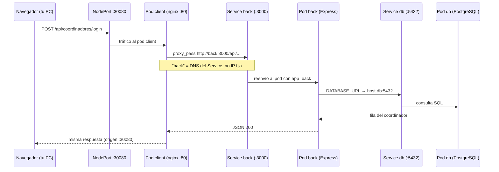

# Kubernetes — Encuesta El Comité

Guía del despliegue en Kubernetes para este proyecto: qué es, cómo funciona y cómo usarlo paso a paso.

← [Volver al README principal](../README.md)

## Índice

| Sección | Contenido |
|---------|-----------|
| [¿Qué es Kubernetes?](#qué-es-kubernetes) | Conceptos básicos y herramientas |
| [Cómo se conectan los pods](#cómo-se-conectan-los-pods) | **Red del backend** — nginx, Services, BD (lectura recomendada) |
| [Requisitos previos](#requisitos-previos) | Docker, Minikube, kubectl |
| [Manifiesto del proyecto](#manifiesto-del-proyecto) | Componentes y puertos |
| [Despliegue paso a paso](#despliegue-paso-a-paso) | Comandos para levantar el clúster |
| [Uso diario](#uso-diario--comandos-útiles) | Logs, monitoreo, actualizar imágenes |
| [Problemas frecuentes](#problemas-frecuentes) | ImagePullBackOff, init-db, Grafana |

---

## ¿Qué es Kubernetes?

**Kubernetes** (K8s) es un orquestador de contenedores: automatiza dónde corren tus aplicaciones empaquetadas en Docker, las reinicia si fallan y las expone en la red del clúster.

En este proyecto usamos **Minikube**, un clúster Kubernetes local que corre en tu máquina (ideal para desarrollo y entregas académicas).

| Herramienta | Rol |
|-------------|-----|
| **Docker** | Construye las imágenes (`marcelillo/encuestaelcomite-back:latest`, `marcelillo/encuestaelcomite-client:latest`) |
| **Minikube** | Crea el clúster K8s local |
| **kubectl** | CLI para aplicar manifiestos y consultar el estado |
| **manifest.yaml** | Describe *qué* debe existir en el clúster (YAML declarativo) |

---

## ¿Cómo funciona?

Kubernetes trabaja con un modelo **declarativo**: tú describes el estado deseado y el clúster se encarga de alcanzarlo.

```
Tú escribes manifest.yaml  →  kubectl apply  →  Kubernetes crea/actualiza recursos
                                                      ↓
                                              Pods corriendo en nodos
                                                      ↓
                                              Services exponen la red
```

### Conceptos clave (aplicados a este proyecto)

| Concepto | Qué es | En Encuesta El Comité |
|----------|--------|------------------------|
| **Namespace** | Carpeta lógica que agrupa recursos | `encuesta` — todo vive aquí |
| **Pod** | Uno o más contenedores que comparten red | Cada Deployment crea pods |
| **Deployment** | Mantiene N réplicas de un pod; reinicia si fallan | `db`, `back`, `client`, `prometheus`, `grafana` |
| **Service** | IP estable y DNS interno para llegar a los pods | `back:3000`, `db:5432`, `client:80` |
| **NodePort** | Expone un servicio en un puerto fijo del nodo | App `:30080`, Grafana `:30300`, Prometheus `:30090` |
| **Secret** | Credenciales (no van en texto plano en el repo en prod.) | `postgres-secret` → `DATABASE_URL` |
| **PVC** | Disco persistente para datos | `postgres-pvc` — datos de PostgreSQL |
| **ConfigMap** | Configuración no sensible | Prometheus scrape, dashboards Grafana |
| **Job** | Tarea que corre una vez y termina | `init-db` — migración y seed de la BD |
| **Probe** | Comprueba si un contenedor está listo o vivo | `/health` en backend, `pg_isready` en Postgres |

### Arquitectura del clúster

```
[Navegador]
     │
     ▼ NodePort 30080
[client / nginx] ──proxy /api/*──► [back / Express :3000]
                                        │
                                        ├── /metrics ──► [Prometheus :30090]
                                        │                      │
                                        ▼                      ▼
                                   [db / PostgreSQL]    [Grafana :30300]
                                   (PVC persistente)    (lee Prometheus)

Job init-db (una vez): migrate + seed ──► db
```

El frontend (nginx) sirve los archivos estáticos de React y reenvía las peticiones `/api/*` al backend dentro del clúster, sin que el navegador hable directamente con Express.

> Explicación ampliada paso a paso (capas de red, nginx, `DATABASE_URL`, login de ejemplo, comandos de prueba): [Cómo se conectan los pods](#cómo-se-conectan-los-pods).

---

## Cómo se conectan los pods

Esta sección explica **cómo llega una petición del navegador hasta PostgreSQL** y por qué en Kubernetes no basta con “abrir el puerto del backend” como en desarrollo local.

### Modelo mental: tres piezas por cada aplicación

Para cada componente (`back`, `client`, `db`…) Kubernetes usa siempre la misma tríada:

| Pieza | Qué hace | Analogía |
|-------|----------|----------|
| **Deployment** | Receta: “quiero 1 réplica de esta imagen con estas variables” | La ficha de un empleado (qué debe hacer) |
| **Pod** | La instancia real que corre (1 o más contenedores) | El empleado en su puesto hoy |
| **Service** | Nombre y puerto **fijos** que apuntan a los pods correctos | La extensión telefónica de ese puesto |

**Lo importante:** el pod tiene una IP interna que **cambia** si se reinicia. Por eso nadie escribe `http://10.244.0.15:3000` en la configuración. Todos usan el nombre del Service: `back`, `db`, `client`.

Todo el proyecto vive en el namespace `encuesta`. Dentro de ese namespace, escribir `back` es suficiente; Kubernetes lo resuelve como si fuera un mini-DNS:

```
back          →  Service back  →  pod(s) con label app=back
db            →  Service db    →  pod(s) con label app=db
client        →  Service client → pod(s) con label app=client
```

Nombre largo (equivalente): `back.encuesta.svc.cluster.local`

---

### Vista general: tres capas de red

Piensa el despliegue en **tres capas**. Cada capa solo conoce la siguiente:

```
┌─────────────────────────────────────────────────────────────────────────┐
│  CAPA EXTERNA — Lo que ve el usuario (tu PC / navegador)                 │
│                                                                         │
│   http://127.0.0.1:30080  ──►  Service "client" (NodePort 30080)      │
└─────────────────────────────────────────────────────────────────────────┘
                                    │
                                    ▼
┌─────────────────────────────────────────────────────────────────────────┐
│  CAPA INTERNA — Dentro del clúster (pods hablando entre sí)             │
│                                                                         │
│   Pod client (nginx :80)                                                │
│        │  /api/*  ──proxy──►  Service "back" (:3000)  ──►  Pod back    │
│        │                           │                                    │
│        │                           └──►  Service "db" (:5432) ──► Pod db│
│        │                                                                │
│   Pod prometheus ──scrape──► back:3000/metrics                          │
│   Job init-db    ──SQL──────► db:5432                                   │
└─────────────────────────────────────────────────────────────────────────┘
                                    │
                                    ▼
┌─────────────────────────────────────────────────────────────────────────┐
│  CAPA DE DATOS — PostgreSQL en disco persistente (PVC)                  │
│   Los datos sobreviven si el pod db se reinicia                         │
└─────────────────────────────────────────────────────────────────────────┘
```

**Regla clave:** el backend (`back`) solo existe en la **capa interna**. No hay NodePort ni URL pública para Express. Si abres `http://localhost:3000` en tu PC esperando el API, **no funcionará** — ese puerto no está publicado hacia fuera.

---

### Capa 1: El navegador solo habla con el frontend

Cuando ejecutas:

```bash
minikube service client -n encuesta --url
```

obtienes algo como `http://127.0.0.1:30080`. Esa URL llega al **Service `client`**, que tiene tipo **NodePort**:

- **Puerto del contenedor:** 80 (nginx sirve el HTML/JS de React).
- **Puerto del nodo (tu máquina):** 30080 — es la “puerta de entrada” única de la aplicación web.

El navegador descarga `index.html`, `main.js`, etc. desde nginx. Hasta aquí **no ha habido ninguna llamada al backend**.

#### ¿Por qué React no llama a `localhost:3010` como en Docker Compose?

En desarrollo con Docker Compose, el frontend usa `VITE_API_ORIGIN=http://localhost:3010` y el navegador llama al API en otro puerto.

En Kubernetes el build usa `Dockerfile.k8s` con `VITE_API_ORIGIN` **vacío**. Las peticiones del frontend van a rutas **relativas**:

```
POST /api/coordinadores/login    (mismo host que la página: :30080)
```

Eso permite que **nginx**, que está en el mismo host, intercepte `/api/` y reenvíe el tráfico al backend dentro del clúster. El navegador nunca necesita saber dónde está Express.

---

### Capa 2: nginx hace de “puente” hacia el backend

Dentro del pod `client` corre **nginx** (no Node). Su configuración está en `packages/client/nginx.k8s.conf`:

```nginx
location /api/ {
    proxy_pass http://back:3000/api/;
    ...
}
```

Desglose de una petición `POST http://127.0.0.1:30080/api/encuestas`:

| Paso | Quién | Qué ocurre |
|------|-------|------------|
| 1 | Navegador | Envía la petición al puerto **30080** (frontend). |
| 2 | nginx | Ve que la ruta empieza por `/api/` y aplica `proxy_pass`. |
| 3 | nginx | Resuelve el host **`back`** con el DNS interno de K8s. |
| 4 | Service `back` | Recibe en puerto **3000** y reenvía al pod con `app: back`. |
| 5 | Express | Procesa la ruta `/api/encuestas` y responde JSON. |
| 6 | nginx | Devuelve esa respuesta al navegador (el navegador cree que todo vino del :30080). |

También se proxyan (misma lógica):

- `/api-docs` → `http://back:3000/api-docs` (Swagger)
- `/openapi.json` → `http://back:3000/openapi.json`

**`back` aquí no es un dominio de internet.** Es el nombre del Service de Kubernetes. Solo funciona **desde dentro del clúster** (por eso nginx puede usarlo y tu navegador no).

#### Service `back`: ClusterIP (solo interno)

En `manifest.yaml`, el Service `back` tiene `type: ClusterIP` (valor por defecto). Eso significa:

- Tiene IP estable **dentro** del clúster.
- **No** se publica en tu `localhost`.
- Solo otros pods (nginx, Prometheus, el Job) pueden conectarse.

Comparación con el Service `client`:

| Service | Tipo | ¿Accesible desde tu PC? | ¿Quién lo usa? |
|---------|------|-------------------------|----------------|
| `client` | NodePort (30080) | Sí → `http://127.0.0.1:30080` | Navegador |
| `back` | ClusterIP | No | nginx, Prometheus, init-db |
| `db` | ClusterIP | No | back, init-db |

---

### Capa 3: Express se conecta a PostgreSQL

El pod `back` no guarda datos en memoria: usa **Sequelize** contra PostgreSQL. La cadena de conexión no está hardcodeada en el código; Kubernetes la inyecta como variable de entorno desde un **Secret**:

```yaml
# manifest.yaml — Deployment back
env:
  - name: DATABASE_URL
    valueFrom:
      secretKeyRef:
        name: postgres-secret
        key: DATABASE_URL
```

El Secret define:

```
postgresql://encuesta:encuesta@db:5432/encuestaelcomite
         │        │         │  │    │
         │        │         │  │    └── nombre de la base de datos
         │        │         │  └── puerto del Service db
         │        │         └── host = nombre del Service PostgreSQL (NO localhost)
         │        └── contraseña
         └── usuario
```

| Parte | Valor | Significado |
|-------|-------|-------------|
| Host `db` | Service Kubernetes | Apunta al pod de PostgreSQL, igual que `back` apunta al pod de Express |
| Puerto `5432` | Puerto del Service `db` | PostgreSQL escucha en 5432 dentro del pod |
| Usuario/contraseña | `encuesta` / `encuesta` | Credenciales del contenedor Postgres (definidas en el mismo Secret) |

**¿Por qué no `localhost` en DATABASE_URL?** Dentro del pod `back`, `localhost` sería el propio contenedor de Express, no la máquina donde corre Postgres. PostgreSQL está en **otro pod**; el único nombre que lo encuentra es `db`.

#### Cómo se enlaza Service → Pod (etiquetas)

Kubernetes no “adivina” qué pod es el backend. Usa **labels** y **selectors**:

```
Deployment "back"  crea pods con label:  app: back
Service "back"     selector:             app: back   →  solo esos pods reciben tráfico
```

Lo mismo para `db` y `client`. Si el pod del backend muere y Kubernetes crea uno nuevo con otra IP, el Service `back` sigue funcionando porque sigue buscando pods con `app: back`.

#### Probes: cuándo el backend “está listo”

Antes de enviarle tráfico, Kubernetes comprueba el pod `back`:

- **readinessProbe:** `GET /health` en puerto 3000 → si falla (p. ej. BD caída), el Service no envía peticiones.
- **livenessProbe:** `GET /health` → si falla repetidamente, reinicia el contenedor.

`/health` en el código verifica que PostgreSQL responde. Por eso el orden importa: **primero `db`, luego `back`**.

---

### Caso completo: coordinador inicia sesión

Supón que la app está en `http://127.0.0.1:30080` y el usuario envía su correo.

```
1. [Navegador]
   POST http://127.0.0.1:30080/api/coordinadores/login
   Body: { "correo": "coord.local@ejemplo.dev" }

2. [NodePort 30080 → Service client → Pod client:80]
   nginx recibe la petición en /api/coordinadores/login

3. [nginx → Service back:3000]
   proxy_pass reescribe a http://back:3000/api/coordinadores/login

4. [Pod back — Express]
   coordinadorController valida el correo

5. [Express → Service db:5432]
   Sequelize: SELECT * FROM coordinadores WHERE correo = ...

6. [Pod db — PostgreSQL]
   Devuelve la fila del coordinador

7. [Respuesta en cadena inversa]
   PostgreSQL → Express (JSON 200) → nginx → navegador
```

El usuario solo vio una URL (`:30080`). Por detrás hubo **tres saltos de red internos**: nginx→back, back→db, y vuelta.



---

### Otros componentes que también usan `back` y `db`

| Componente | Conexión | Motivo |
|------------|----------|--------|
| **Job `init-db`** | `DATABASE_URL` → `db:5432` | Corre migraciones y seed **una vez** al desplegar; usa la misma imagen del backend pero no levanta servidor HTTP |
| **Prometheus** | `http://back:3000/metrics` cada 15 s | Configurado en ConfigMap `prometheus-config`; scrapea métricas sin pasar por nginx |
| **Grafana** | `http://prometheus:9090` | Lee datos que Prometheus ya recolectó del backend |

Ninguno de estos sale a internet: todo es red interna del namespace `encuesta`.

---

### Orden de arranque (por qué importa)

```
1. db       PostgreSQL + volumen (PVC) — sin BD no hay /health ni tablas
2. back     Express — necesita db para conectar Sequelize
3. init-db  Job — crea tablas y datos de prueba en db
4. client   nginx — puede proxyar al back ya migrado
   prometheus / grafana — monitoreo (independiente de la app)
```

`k8s/deploy.sh` espera explícitamente a que `db` y `back` estén `Available` antes de relanzar `init-db`.

---

### Comprobar cada eslabón (comandos prácticos)

Con el clúster desplegado, puedes **verificar** cada parte de la cadena:

```bash
# 1. Ver que todos los pods están Running
kubectl get pods -n encuesta

# 2. Ver Services y sus puertos (client tiene NodePort 30080; back y db solo ClusterIP)
kubectl get svc -n encuesta

# 3. Desde el pod client, probar que nginx alcanza al backend
kubectl exec -n encuesta deployment/client -- wget -qO- http://back:3000/health

# 4. Desde el pod back, probar que Express alcanza PostgreSQL (health incluye db)
kubectl exec -n encuesta deployment/back -- wget -qO- http://localhost:3000/health

# 5. Ver la DATABASE_URL que ve el backend (host debe ser "db")
kubectl exec -n encuesta deployment/back -- printenv DATABASE_URL

# 6. Logs si algo falla en la cadena
kubectl logs deployment/back -n encuesta
kubectl logs deployment/client -n encuesta
kubectl logs job/init-db -n encuesta
```

Resultado esperado del paso 3: JSON con `"status":"ok"`. Si falla, el problema está entre nginx y back. Si el paso 3 funciona pero la app en el navegador no, revisa el frontend o CORS.

---

### Preguntas frecuentes sobre la red

**¿Puedo abrir el backend directo en el navegador (`http://localhost:3000`)?**  
No en este manifiesto. El Service `back` es ClusterIP: no hay puerto publicado en tu máquina. El API solo se alcanza vía `/api/...` en el puerto **30080** del frontend, o ejecutando `kubectl port-forward` manualmente para depurar.

**¿Por qué en Docker Compose el backend está en `:3010` y aquí no?**  
En Compose se publica `3010:3000` para comodidad en desarrollo. En K8s se eligió **un solo punto de entrada** (el frontend) que hace proxy. Es un patrón habitual en producción (un ingress o reverse proxy delante de varios servicios).

**¿El nombre `back` lo inventó Kubernetes?**  
No: lo definimos nosotros en `manifest.yaml` como `metadata.name` del Service. Podríamos llamarlo `api` o `servidor`, pero tendríamos que cambiar también `nginx.k8s.conf` y `prometheus.yml` para usar el mismo nombre.

**¿Qué pasa si hay 2 réplicas del backend?**  
El Service `back` repartiría peticiones entre ambos pods (balanceo por defecto). En este proyecto `replicas: 1` para simplificar.

**¿Los datos de PostgreSQL se pierden al reiniciar el pod `db`?**  
No, si el PVC está montado: los datos viven en el volumen `postgres-pvc`, no dentro del contenedor efímero.

---

### Resumen en una frase

El **navegador** solo entra por **client:30080**; **nginx** traduce `/api` a **back:3000** (red interna); **Express** persiste en **db:5432** (otro Service interno). Los nombres `client`, `back` y `db` son la “agenda telefónica” de Kubernetes — no URLs de internet.

### Comparación rápida con Docker Compose

| Aspecto | Docker Compose | Kubernetes (este proyecto) |
|---------|----------------|----------------------------|
| Entrada del usuario | `localhost:3000` (frontend) | `localhost:30080` (NodePort → client) |
| Frontend → API | Navegador → `localhost:3010` | Navegador → `/api` en :30080 → nginx → `back:3000` |
| Backend → BD | `db:5432` en `DATABASE_URL` | Igual: host `db`, puerto `5432` |
| ¿Backend expuesto? | Sí, puerto 3010 | No; solo ClusterIP |
| Nombres de host | Servicios Compose (`back`, `db`) | Services K8s (`back`, `db`) — mismo concepto, distinta implementación de red |

---

## Requisitos previos

Instala una sola vez:

1. [Docker Desktop](https://www.docker.com/products/docker-desktop/) — debe estar **en ejecución**
2. [Minikube](https://minikube.sigs.k8s.io/docs/start/)
3. **kubectl** — suele instalarse con Minikube o Docker Desktop

Verificar:

```bash
docker version
minikube version
kubectl version --client
```

---

## Manifiesto del proyecto

Todo está en un único archivo: **`k8s/manifest.yaml`**

| Componente | Tipo K8s | Imagen en `manifest.yaml` | Acceso |
|------------|----------|---------------------------|--------|
| **db** | Deployment + PVC + Service | `postgres:16-alpine` | Interno (`db:5432`) |
| **back** | Deployment + Service (ClusterIP) | `marcelillo/encuestaelcomite-back:latest` | Interno (`back:3000`) — ver [conexión de pods](#cómo-se-conectan-los-pods) |
| **client** | Deployment + Service (NodePort) | `marcelillo/encuestaelcomite-client:latest` | **http://…:30080** |
| **init-db** | Job | `marcelillo/encuestaelcomite-back:latest` | Se ejecuta una vez; conecta a `db` |
| **prometheus** | Deployment + Service (NodePort) | `prom/prometheus:v2.54.1` | **http://…:30090** — scrapea `back:3000/metrics` |
| **grafana** | Deployment + Service (NodePort) | `grafana/grafana:11.2.2` | **http://…:30300** — lee `prometheus:9090` |

### Imágenes Docker: dos formas de obtenerlas

El manifiesto referencia **`marcelillo/encuestaelcomite-back:latest`** y **`marcelillo/encuestaelcomite-client:latest`**. Elige una opción:

| Opción | Cuándo usarla | Qué hacer |
|--------|---------------|-----------|
| **A — Docker Hub** | Primera prueba sin compilar | `kubectl apply -f k8s/manifest.yaml` (Minikube descarga las imágenes del registro) |
| **B — Build local** | Cambiaste código y quieres probar en Minikube | `eval $(minikube docker-env)` y construye con las **mismas etiquetas** del manifiesto (ver paso 3 del despliegue o `./k8s/deploy.sh`) |

> Si construyes con otro nombre de etiqueta (p. ej. `encuestaelcomite-back:k8s`), debes cambiar también las referencias `image:` en `manifest.yaml` o el pod quedará en `ImagePullBackOff`.

---

## Despliegue paso a paso

### 1. Iniciar Minikube

```bash
minikube start --driver=docker --cpus=4 --memory=4096
```

Si ya estaba iniciado: `minikube status`

### 2. Apuntar Docker al daemon de Minikube

Las imágenes deben construirse **dentro** del entorno de Minikube para que el clúster las encuentre sin subirlas a un registro.

**Git Bash / Linux / macOS:**

```bash
eval $(minikube docker-env)
```

**Windows PowerShell:**

```powershell
& minikube -p minikube docker-env | Invoke-Expression
```

Comprobar: `docker images` debe listar imágenes del clúster de Minikube.

### 3. Construir imágenes del proyecto

Desde la **raíz del repositorio**:

```bash
docker build -f packages/server/Dockerfile -t marcelillo/encuestaelcomite-back:latest .
docker build -f packages/client/Dockerfile.k8s -t marcelillo/encuestaelcomite-client:latest .
```

Si usas la **opción A** (imágenes de Docker Hub), puedes saltar este paso.

### 4. Aplicar el manifiesto

**Opción rápida (script):**

```bash
chmod +x k8s/deploy.sh
./k8s/deploy.sh
```

**Opción manual:**

```bash
kubectl apply -f k8s/manifest.yaml

kubectl wait --for=condition=available deployment/db -n encuesta --timeout=180s
kubectl wait --for=condition=available deployment/back -n encuesta --timeout=180s

# Job init-db: debe correr DESPUÉS de db y back
kubectl delete job init-db -n encuesta --ignore-not-found
kubectl apply -f k8s/manifest.yaml
kubectl wait --for=condition=complete job/init-db -n encuesta --timeout=300s
```

> **Orden importante:** PostgreSQL primero → backend → job de migración → frontend y monitoreo (el manifiesto los crea todos, pero el Job necesita que la BD y el backend estén listos).

### 5. Abrir la aplicación

```bash
minikube service client -n encuesta --url
```

Abre la URL que imprime (ej. `http://127.0.0.1:30080`).

**Login de prueba** (tras `init-db`):

| Correo | Rol |
|--------|-----|
| `coord.local@ejemplo.dev` | Coordinador de prueba |
| `carolina.estrada@elcomite.org.co` | Coordinador seed |

---

## Uso diario — comandos útiles

### Ver estado del clúster

```bash
kubectl get pods -n encuesta              # pods y su estado (Running, Pending…)
kubectl get svc -n encuesta               # servicios y puertos
kubectl get all -n encuesta               # resumen completo
kubectl describe pod <nombre-pod> -n encuesta   # detalle de un pod
```

### Logs

```bash
kubectl logs deployment/back -n encuesta
kubectl logs deployment/client -n encuesta
kubectl logs deployment/db -n encuesta
kubectl logs job/init-db -n encuesta
```

### Acceder a servicios

```bash
minikube service client -n encuesta --url
minikube service grafana -n encuesta --url
minikube service prometheus -n encuesta --url
minikube dashboard   # UI web del clúster
```

### Monitoreo (Grafana + Prometheus)

| Servicio | URL | Credenciales |
|----------|-----|--------------|
| **Grafana** | `minikube service grafana -n encuesta --url` | `admin` / `encuesta` |
| **Prometheus** | `minikube service prometheus -n encuesta --url` | — |

En Prometheus: **Status → Targets** → el job `encuesta-backend` debe estar **UP**.

Dashboard precargado en Grafana: **Encuesta El Comité — Resumen** (peticiones/s, errores 5xx, latencia p95, memoria, contadores de BD).

### Actualizar tras cambiar código

```bash
eval $(minikube docker-env)
docker build -f packages/server/Dockerfile -t marcelillo/encuestaelcomite-back:latest .
docker build -f packages/client/Dockerfile.k8s -t marcelillo/encuestaelcomite-client:latest .
kubectl rollout restart deployment/back deployment/client -n encuesta
```

### Detener o borrar todo

```bash
kubectl delete -f k8s/manifest.yaml          # borra recursos del manifiesto
kubectl delete namespace encuesta            # borra todo el namespace
minikube stop                                # apaga el clúster
minikube delete                              # elimina el clúster por completo
```

---

## Qué hace `kubectl apply`

| Comando | Efecto |
|---------|--------|
| `kubectl apply -f k8s/manifest.yaml` | Crea o actualiza recursos según el YAML |
| `kubectl delete -f k8s/manifest.yaml` | Elimina los recursos definidos en el archivo |
| `kubectl get …` | Consulta el estado actual |
| `kubectl wait …` | Espera hasta que una condición se cumpla |

Kubernetes compara el manifiesto con lo que ya existe. Si cambias una réplica, una imagen o una variable de entorno y vuelves a aplicar, actualiza solo lo necesario.

---

## Evidencia para entrega

1. Captura de `kubectl get pods -n encuesta` con **db**, **back**, **client**, **prometheus** y **grafana** en `Running`.
2. Captura del navegador en la URL de `minikube service client`.
3. Captura del dashboard de Grafana con métricas visibles.
4. (Opcional) Prometheus → Targets con `encuesta-backend` en verde.

---

## Problemas frecuentes

### Docker no conecta / Minikube no arranca

Docker Desktop debe estar **abierto y en ejecución** antes de `minikube start`.

### `ImagePullBackOff`

Suele deberse a una de estas causas:

1. **Imagen construida fuera del Docker de Minikube** — el clúster no la ve.
2. **Etiqueta distinta a la del manifiesto** — el pod busca `marcelillo/encuestaelcomite-back:latest` y no encuentra la imagen local.

Solución (build local en Minikube):

```bash
eval $(minikube docker-env)
docker build -f packages/server/Dockerfile -t marcelillo/encuestaelcomite-back:latest .
docker build -f packages/client/Dockerfile.k8s -t marcelillo/encuestaelcomite-client:latest .
kubectl rollout restart deployment/back deployment/client -n encuesta
```

Alternativa: deja el manifiesto como está y deja que Minikube **descargue** las imágenes de Docker Hub (opción A en [Imágenes Docker](#imágenes-docker-dos-formas-de-obtenerlas)).

### El job `init-db` falla

```bash
kubectl logs job/init-db -n encuesta
kubectl delete job init-db -n encuesta
kubectl apply -f k8s/manifest.yaml
```

### Grafana muestra "No data"

1. Verifica en Prometheus que `encuesta-backend` esté **UP** en `/metrics`.
2. Reconstruye el backend si la imagen es antigua:

```bash
eval $(minikube docker-env)
docker build --no-cache -f packages/server/Dockerfile -t marcelillo/encuestaelcomite-back:latest .
kubectl rollout restart deployment/back -n encuesta
```

3. Genera tráfico en la app (login, listar encuestas) y espera ~30 s.

### Puerto 30080 ocupado

Edita `nodePort` en la sección `Service` `client` dentro de `k8s/manifest.yaml` (rango 30000–32767) y vuelve a aplicar.

---

## Kubernetes vs Docker Compose

| | Docker Compose | Kubernetes (este proyecto) |
|--|----------------|----------------------------|
| **Uso** | Desarrollo local rápido | Orquestación, entrega académica, escalado |
| **Comando** | `docker compose up` | `kubectl apply -f k8s/manifest.yaml` |
| **Red** | Red bridge de Docker | Services + DNS interno del clúster |
| **Escalado** | Manual (`scale` limitado) | Réplicas en Deployment |
| **Persistencia** | Volúmenes Docker | PersistentVolumeClaim |

Para el día a día en desarrollo, `docker compose up` sigue siendo la opción más simple (ver README principal). Kubernetes demuestra despliegue en clúster con frontend, backend, BD y monitoreo.

---

## Referencia rápida

```bash
# Desplegar
./k8s/deploy.sh

# Estado
kubectl get pods,svc -n encuesta

# App
minikube service client -n encuesta --url

# Monitoreo
minikube service grafana -n encuesta --url    # admin / encuesta
minikube service prometheus -n encuesta --url
```
